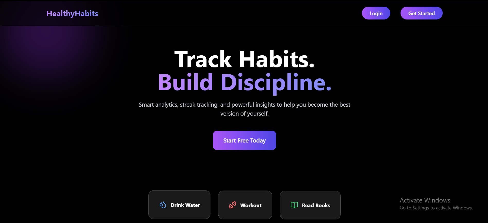
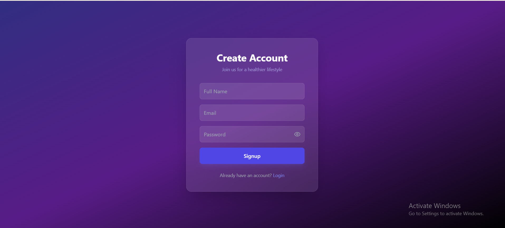
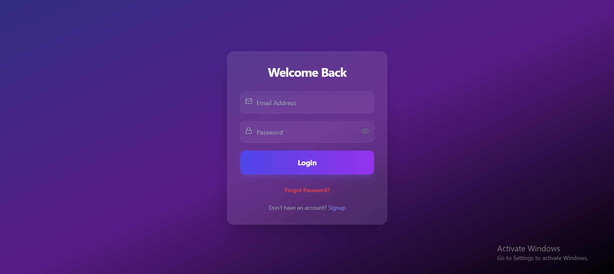
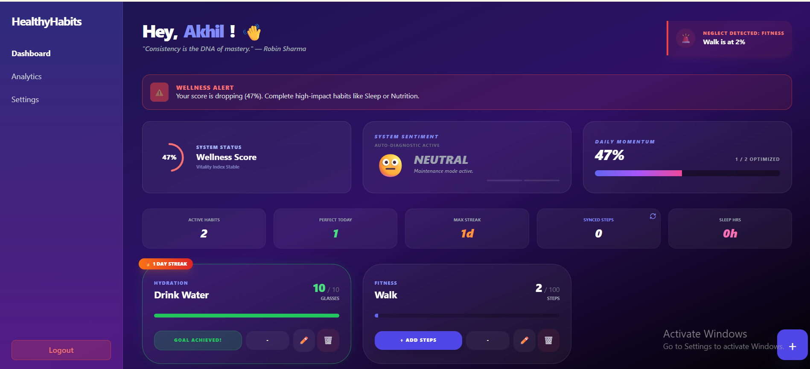
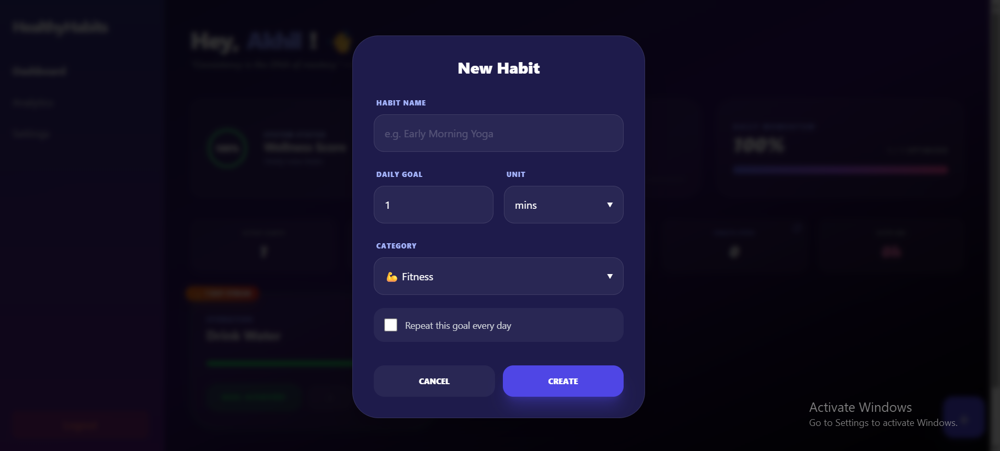
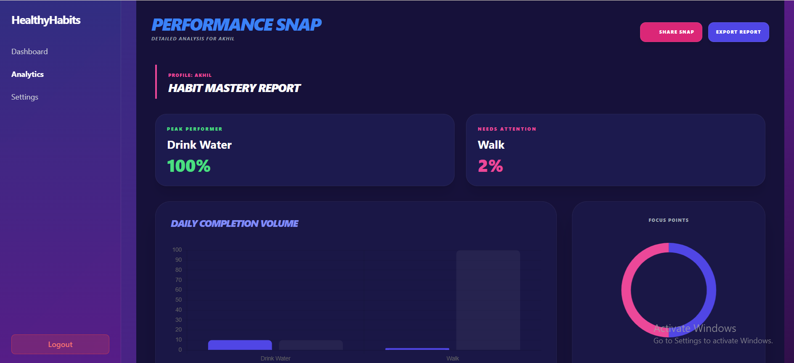
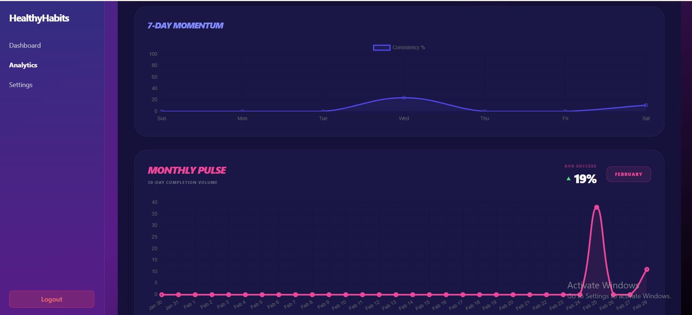
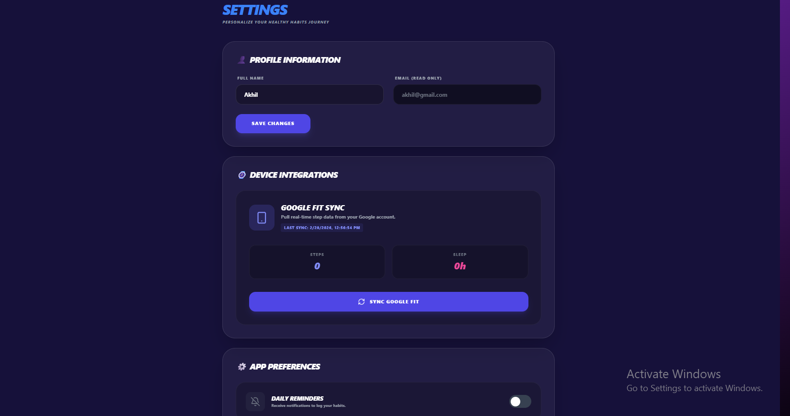

# 🥗 Healthy Habits Tracker

A full-stack web application that allows users to securely track and manage their daily habits with authentication and persistent database storage.

---

## 🚀 Live Links

**Frontend (Netlify):**  
https://healthy-habits-trackerr.netlify.app/

**Backend API (Render):**  
https://healthy-habits-tracker-backend.onrender.com

**Backend Github Repo:**
https://github.com/ARCHANA-MADDELA-57/healthy-habits-tracker-backend

---

## 📌 Project Description

Healthy Habits Tracker is a full-stack productivity application developed to help users build and maintain daily habits.

The application allows users to:

- Create an account
- Log in securely
- Add daily habits
- Mark habits as completed
- Delete habits
- Persist data securely in a database

This project demonstrates end-to-end full-stack development including authentication, REST API integration, database design, and deployment.

---

## ✨ Features

### 🔐 Authentication
- User Signup
- Secure Login
- Password hashing using bcrypt
- JWT-based authentication
- Protected dashboard routes

### 🥗 Habit Management
- Add new habits
- Edit habits
- View all habits
- log the progress
- Mark habits as completed
- Delete habits
- Data persists after refresh

### 🔒 Security
- JWT token validation middleware
- User-specific habit isolation
- Hashed password storage

### 🌐 Deployment
- Frontend deployed on Netlify
- Backend deployed on Render
- Environment-based API configuration

---

## 🛠 Tech Stack

### Frontend
- React.js
- Tailwind CSS
- React Router DOM
- Axios

### Backend
- Node.js
- Express.js
- Supabase
- JWT (JSON Web Token)
- bcrypt

### Deployment
- Netlify (Frontend)
- Render (Backend)

---

## 🏗️ Application Architecture

User  
→ React Frontend  
→ Axios API Calls  
→ Express Server  
→ JWT Middleware  
→ Supabase Database  
→ JSON Response  
→ UI Update  

---

## 📡 API Documentation

### 🔐 Authentication Routes

#### POST `/api/auth/signup`
Registers a new user.

Request Body:

```json
{
  "email": "test@example.com",
  "password": "123456"
}
```

---

#### POST `/api/auth/login`
Logs in user and returns JWT token.

Response:

```json
{
  "token": "JWT_TOKEN"
}
```

---

### 🥗 Habit Routes (Protected)

All routes require:

```
Authorization: Bearer <token>
```

- GET `/api/habits/my-habits` – Get all habits  
- POST `/api/habits/add` – Create new habit  
- PUT `/api/habits/update/${id}` – Update habit  
- DELETE `/api/habits/${id}` – Delete habit 
- Increment `/api/habits/increment/${id}` - Increment habit progress
- Decrement `/api/habits/decrement/${id}` - Decrement habit progress

---

## 🗄 Database Schema (Supabase - PostgreSQL)

---

### 👤 Users Table (profile)

| Column Name | Data Type | Description |
|------------|-----------|-------------|
| id | UUID (Primary Key) | Unique user identifier |
| full_name | VARCHAR | User's full name |
| email | VARCHAR (Unique) | User's email address |
| created_at | TIMESTAMP | Account creation timestamp |

---

### 🥗 Habits Table

| Column Name | Data Type | Description |
|------------|-----------|-------------|
| id | UUID (Primary Key) | Unique habit identifier |
| user_id | UUID (Foreign Key) | References `profile.id` |
| title | VARCHAR | Name of the habit |
| description | TEXT | Detailed habit description |
| target | INTEGER / NUMERIC | Target value to achieve |
| current | INTEGER / NUMERIC | Current progress value |
| unit | VARCHAR | Unit of measurement (e.g., km, minutes) |
| category | VARCHAR | Habit category (e.g., Health, Study) |
| streak | INTEGER | Current consecutive completion count |
| is_everyday | BOOLEAN | Whether habit repeats daily |
| completed_today | BOOLEAN | Whether completed for current day |
| progress | NUMERIC | Calculated progress percentage |
| is_archived | BOOLEAN | Soft delete / archive flag |
| last_updated | TIMESTAMP | Last update timestamp |
| created_at | TIMESTAMP | Habit creation timestamp |
| last_notified_at | TIMESTAMP | Last reminder notification time |
| last_reset_date | DATE | Last streak reset date |

---

## 🔗 Table Relationship

- One user can have multiple habits.
- `user_id` in the `habits` table references `id` in the `profile` table.
- Foreign key ensures user-specific habit isolation.

---

## 📦 Installation & Setup

## Folder Structure

src/
│
├── components/
├── pages/
├── context/
├── services/
├── hooks/ 
├── utils/ 
└── App.jsx


### 1️⃣ Clone the Repositories

```bash
git clone https://github.com/ARCHANA-MADDELA-57/healthy-habits-Tracker-frontend.git
git clone https://github.com/ARCHANA-MADDELA-57/healthy-habits-tracker-backend.git
```

---

### 2️⃣ Backend Setup

```bash
cd healthy-habits-tracker-backend
npm install
```

Create a `.env` file:

```
PORT=5000
SUPABASE_URL=your_supabase_url
SUPABASE_KEY=your_supabase_anon_key
JWT_SECRET=your_random_secret_string
```

Run the server:

```bash
npm start
```

---

### 3️⃣ Frontend Setup

```bash
cd healthy-habits-Tracker-frontend
npm install
npm run dev
```

Create a `.env` file:

```
VITE_API_URL=https://healthy-habits-tracker-backend.onrender.com
```

---

## 🔑 Demo Credentials

Email: akhil@gmail.com  
Password: Akhil@123  

Or register a new account.

---

## 📸 Screenshots

Add screenshots inside a `screenshots` folder:

```markdown








```

---

## 🎥 Video Walkthrough

Add your Loom or YouTube walkthrough link here.

---

## 📚 Key Learnings

- Implementing JWT-based authentication
- Building protected REST APIs
- Connecting frontend to deployed backend
- Handling CORS issues in production
- Structuring backend using routes, controllers, and middleware
- Deploying full-stack applications

---

## 🚀 Future Improvements

- AI-Powered Habit Recommendations  
- Custom Habit Challenges  
- Dark Mode  

---

## ⭐ Project Highlights

- Full-stack architecture
- Secure authentication system
- RESTful API design
- Production deployment
- User-specific data isolation

---

## 👩‍💻 Author

**Maddela Archana**

🌐 Portfolio: https://maddela-archana.vercel.app/ 
💼 LinkedIn: https://www.linkedin.com/in/archana-maddela/ 
📧 Email: archanaarchu5757@gmail.com 

---

If you like this project, feel free to connect with me!